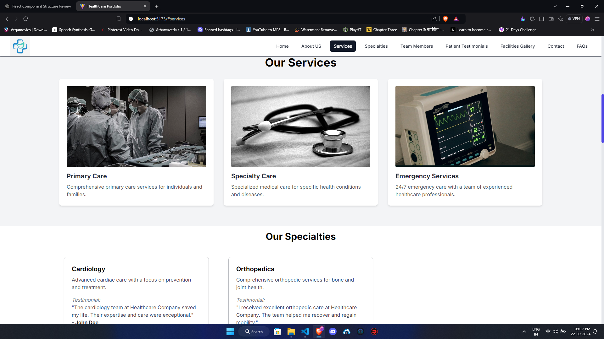

# 🌟 Healthcare Portfolio

Welcome to the **Healthcare Portfolio**! This project showcases a modern and responsive healthcare website that highlights various services, specialties, team members, and patient testimonials. It’s designed to enhance user experience while providing essential information about healthcare services.

## 📦 Features

- **Responsive Design**: Mobile-friendly layout for an optimal experience on any device.
- **Dynamic Components**: React components for easy maintenance and scalability.
- **Patient Testimonials**: Real stories from patients to build trust and credibility.
- **Team Showcase**: Introduce healthcare professionals with their credentials and expertise.

## ⚙️ Tech Stack

- **Frontend**: React.js
- **Styling**: Tailwind CSS
- **Icons**: React Icons
- **Deployment**: Vite for fast builds

## 🚀 Getting Started

### Prerequisites

Make sure you have [Node.js](https://nodejs.org/) installed on your machine.

### Installation

1. Clone the repository:

   ```bash
   git clone https://github.com/kabirjaipal/healthcare-portfolio.git
   ```

2. Navigate to the project directory:

   ```bash
   cd healthcare-portfolio
   ```

3. Install the dependencies:

   ```bash
   npm install
   ```

### Running the Project

To start the development server, run:

```bash
npm run dev
```

Open your browser and go to `http://localhost:3000` to view the application.

## 📸 Screenshots





## 🛠️ Contributing

We welcome contributions! If you have suggestions for improvements or new features, please open an issue or submit a pull request.

1. Fork the repository.
2. Create your feature branch.
3. Commit your changes.
4. Push to the branch.
5. Open a pull request.

## 📜 License

This project is licensed under the MIT License - see the [LICENSE](./LICENSE) file for details.

## 📞 Contact

For any inquiries, please reach out to me at [your-email@example.com](mailto:your-email@example.com).

Thank you for visiting the Healthcare Portfolio! 🎉
